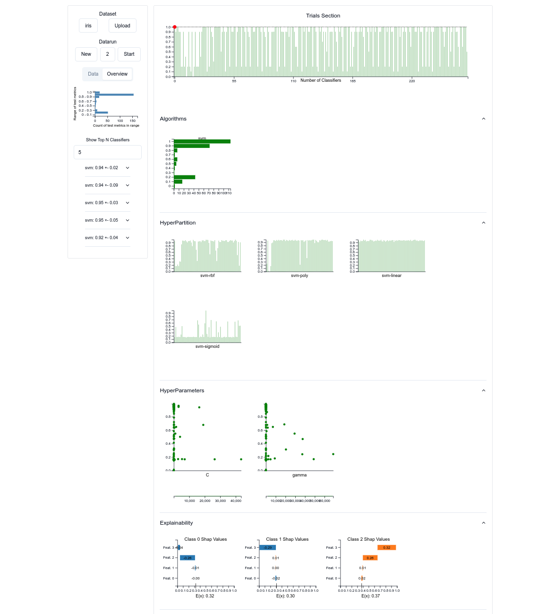

# ATMSeer: Increasing Transparency and Controllability in Automated Machine Learning

## Getting Started

### ATM - Auto Tune Models Docker setup

- **Install Docker:**
  1. Install Docker using the official guide based on your operating system: [Docker Installation Guide](https://docs.docker.com/get-docker/)
  2. Start Docker Engine or Docker Desktop after installation.
  
- **Prerequisites**
  1. Install Docker
  2. Install python 3.10 and set it to default
  3. Google Chrome for viewing application
  
- **Run the project**
  1. To start the application, simply run the following shell script:

```bash
./install.sh
```

## Frontend



